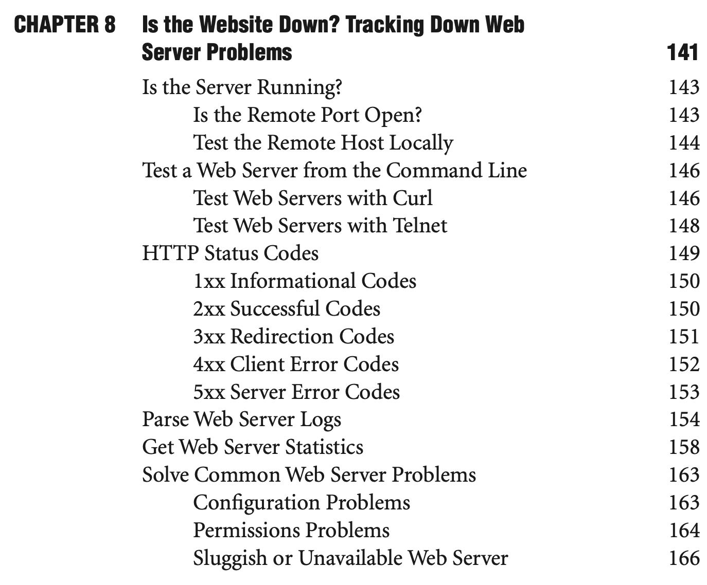
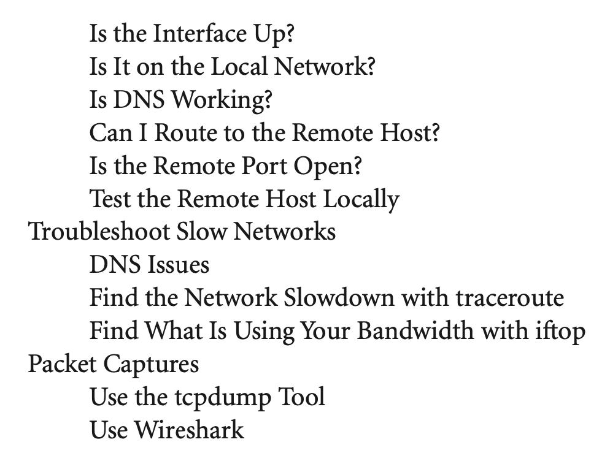
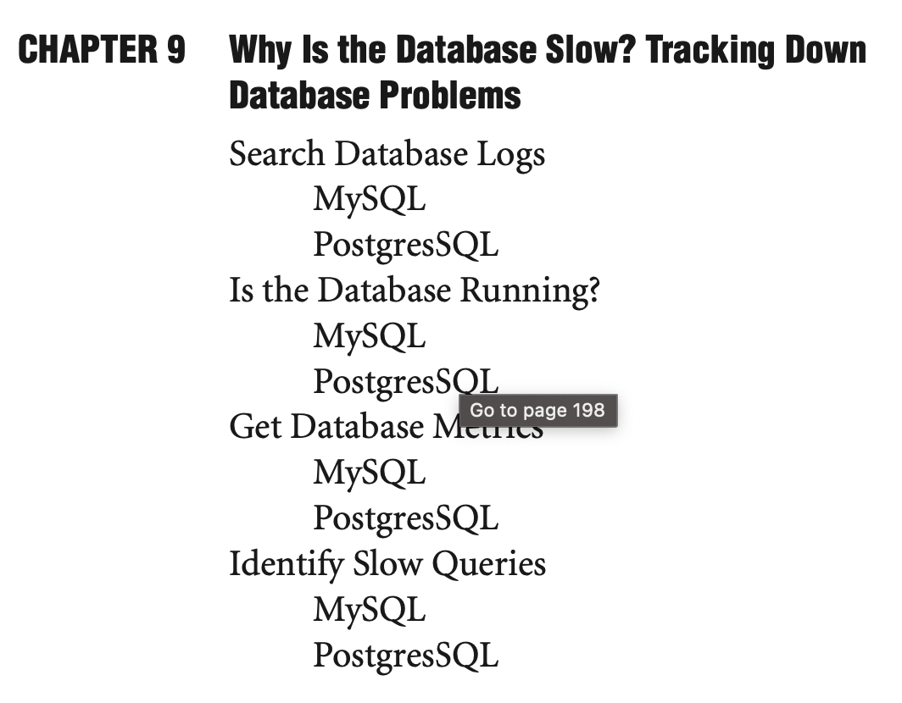

# CHAPTER 8 Is the Website Down? Tracking Down Web Server Problems

Is the Server Running?

Is the Remote Port Open?

Test the Remote Host Locally

Test a Web Server from the Command Line

Test Web Servers with Curl

Test Web Servers with Telnet

Parse Web Server Logs

Get Web Server Statistics

Solve Common Web Server Problems

Configuration Problems

Permissions Problems

Sluggish or Unavailable Web Server

# CHAPTER 5 Is the Server Down? Tracking Down the Source of Network Problems

Server A Can't Talk to Server B

​	Client or Server Problem

​	Is It Plugged In?

CHAPTER 9

Why Is the Database Slow? Tracking Down Database Problems Search Database Logs MySQL PostgresSQL

Is the Database Running?

MySQL

PostgresSOL

Get Database M Co to page 198

MySQL

PostgresSQL

Identify Slow Queries

MySQL

PostgresSQL
