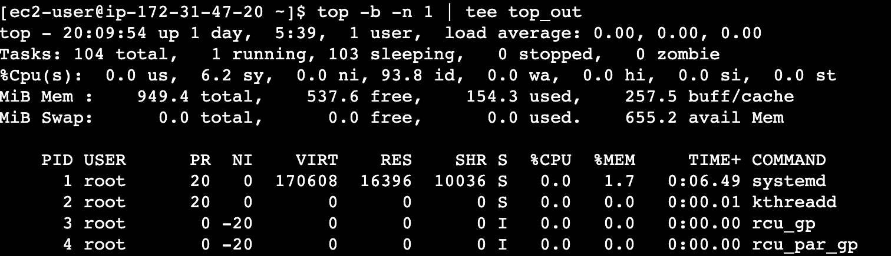

# Linux Security Coaching

<a href="#Linux"> Linux基础知识和常用命令</a>

<a href="#Network"> 计算机网络</a>

# Linux 注意事项

<a id="Linux"> Linux 基础知识</a>

- Linux 严格区分大小写
- Linux 中所有内容以文件形式保存，包括硬件：硬盘文件是/dev/sda-p
- Linux没有扩展名，d.ppt； 不靠扩展名区分文件类型。配置文件：d.conf，脚本文件：d.sh
- Linux所有的存储设备都必须挂载后，用户才可以使用。

以下是常见的Linux目录及其作用的表格：Here's a summarized table of common Linux directories and their functions:

| Name                          | Function                                                     |
| ----------------------------- | ------------------------------------------------------------ |
| **/boot**                     | Stores bootloader and kernel files for system startup 引导加载程序和内核文件 |
| **/bin (binary)**             | Contains essential **binary commands** for boot and recovery 系统启动和恢复时必需的基本命令 |
| **/sbin **(System Binary)     | Holds essential system administration commands系统管理员使用的基本系统命令如reboot、fdisk |
| **/dev (device)**             | Contains device files for hardware device access包含设备文件，用于访问计算机硬件设备 |
| **/etc**                      | Stores system-wide configuration files and directories配置文件和目录，如网络配置、用户配置 |
| **/home**                     | User home directories for personal files and configs 用户的主目录，每个用户在此目录下有一个子目录，用于存储其个人文件和配置。 |
| **/lib (Library)**            | Holds shared library files for system and applications包含共享库文件，这些文件由系统和应用程序使用。 |
| **/media**                    | Mount point for removable media devices 用于挂载可移动媒体设备，如光盘等。 |
| **/mnt (Mount)**              | Used for manually mounting temporary file systems 用于手动挂载临时文件系统, 如USB |
| **/opt (Optional)**           | Typically used for third-party software installation 用于安装和存储第三方软件。 /usr/local/ |
| **/proc (Process)**           | A virtual file system providing process and kernel info 包含有关正在运行的进程和内核状态的虚拟文件系统。/proc/cpuinfo: cpu information, /proc/net/: network protocol information. |
| **/root**                     | Home directory for the superuser (administrator) 超级用户（管理员）的主目录。 |
| **/srv (Service)**            | Contains data files related to provided services 包含服务数据 |
| /tmp                          | Stores temporary files, often cleared upon reboot 用于存储临时文件，重启后通常会清空。 |
| /usr (Unix Software Resource) | Contains system software, libraries, and documentation 包含系统软件资源目录。大多数系统软件、库文件和文档。 |
| /var (Variable)               | Stores frequently changing files like logs and caches包含经常变化的文件，如日志文件、缓存、邮件和打印队列等 |
| /sys                          | vitusal file system. 虚拟文件系统，保存内核相关信息。        |

# Linux常用命令

1. <a href="#anchor"> 文件处理命令</a>
2. <a href="#anchor1"> 权限管理命令</a> 
3. <a href="#anchor2"> 文件搜索命令</a> 
4. <a href="#anchor3">用户管理命令</a> 
5.  <a href="#anchor4">网络命令</a> 
6. <a href="#anchor5">关机重启命令</a>
7. <a href="#anchor6">帮助命令及压缩解压命令</a>

1.<a id="anchor">文件处理命令</a>

- 命令格式
  - 命令 -选项 参数 e.g ls -la /etc
  - 简化选项：-a，完整选项：--all
  - r，w，x
  - -rw-r--r--: 
    - -: 文件类型 （-： 二进制文件；d:目录； l:软连接文件）
    - rw-:u user；r--:g group；r--:o other  （x:执行权限，运行时，是脚本或者命令）

- 目录处理命令

  | command name          | Path          | Access    | Func                    | Grammar                                                      |
  | --------------------- | ------------- | --------- | ----------------------- | ------------------------------------------------------------ |
  | ls (list)             | /bin/ls       | all users | list files in directory | ls -aldhi 文件或目录 （a: all，l:long, h:human, d:directory i:id)  -d:查看当前目录本身的信息；-i：查看id |
  | mkdir                 | /bin/mkdir    | -         | Create directory        | -p: 递归创建  mkdir -p /tmp/Japan/boduo                  |
  | cd (change directory) | Shell内置命令 |           | 切换目录                | cd /path/myfolder/                                           |
  | pwd                   | /bin/pwd      |           | Print working directory | pwd                                                          |
  | rmdir                 | /bin/rmdir    |           | remove empty directory  | Rmdir /path/folder                                           |
  | cp                    | /bin/cp       | -         | copy 文件，改名         | cp  -rp source destination   cp file1 file2 folder (copy 多个文件) |
  | mv                    | /bin/mv       | -         | Move, 改名              | mv /tmp/software /tmp/machine_learning mv file1 file2        |
  | rm                    | /bin/rm       | -         | Remove                  | rm -rf 文件或目录 f:force                                    |

- 文件处理命令

  | command name | Path          | Access    | Func               | Grammar                                                   |
  | ------------ | ------------- | --------- | ------------------ | --------------------------------------------------------- |
  | touch        | /bin/touch    | all users | 创建文件           | touch path/file：touch file.txt     touch "program files" |
  | cat          | /bin/cat      | -         | 显示文件           | cat -n files    -n: 显示行号                          |
  | tac          | /usr/bin/tac  | -         | 从最后一行开始显示 | tac 路径/文件                                             |
  | more         | /bin/more     | -         | 分页显示文件内容   | more 文件名 f或者空格:翻页，enter换行，q退出              |
  | less         | /usr/bin/less | -         | 分页显示，向上翻   | less 文件名，pageup，上箭头，/keyword：搜索，n            |
  | head         | /usr/bin/head | -         | 显示文件前面几行   | head -n 20 /etc/services                                  |
  | tail         | /usr/bin/tail | -         | 文件后面几行       | tail -nf /etc/services -f:动态显示文件末尾内容。监控日志  |

  

- 链接命令

  | command name | Path    | Access    | Func         | Grammar                                         |
  | ------------ | ------- | --------- | ------------ | ----------------------------------------------- |
  | ln           | /bin/ln | all users | 生成链接文件 | ln -s 源文件 目标文件   -s:create soft link |
  
  ln **-s** file files.soft：快捷方式，rwx权限。源文件删除，软连接也就不存在。可以跨分区，对目录可以。
  
  ln file files.hard：硬链接不能跨分区，不可以对目录进行硬链接；与源文件同时更新
  
  

2. <a id="anchor1">权限管理命令</a>

- Chmod: change the permissions mode of a file

  | command name | Path          | Access                  | Func                                                | Grammar                                                      |
  | ------------ | ------------- | ----------------------- | --------------------------------------------------- | ------------------------------------------------------------ |
  | chmod        | /bin/chmod    | all users               | change the permissions mode of a file               | chmod ugoa +-= rwx file/folder, -R  chmod o-w Python (other用户移除w权限) chmod 641 software/Python   chmod -R 666 Python |
  | chown        | /bin/chown    | Root 可以改文件的所有者 | change file ownership                               | chown 用户 文件或者目录 chown Sharon Heng                |
  | chgrp        | /bin/chgrp    | -                       | Change file group ownership                         | chgrp 用户组 文件或者目录 1.Add groud：groupadd Linux_P用户组  chgrp Linux_P Python (1.user name, 2.Group name)  当chmod改变文件的权限，文件的所属组的权限也被改变。 |
  | umask        | Shell内置命令 | -                       | the user file-creation mask显示和设置文件的缺省权限 | umask -S, -S:以rwx形式显示新建文件缺省权限   umask: 0022: ----w--w-  **umask -S**：777-022=755  If umask-->023: **umask 023** 就可以了 |

3. <a id="anchor2">文件搜索命令</a>

- 

  | command name | Path      | Access    | Func     | Grammar                |
  | ------------ | --------- | --------- | -------- | ---------------------- |
  | find         | /bin/find | all users | 文件搜索 | find 搜索范围 匹配条件 |

4. <a id="anchor3">用户管理命令</a> 

5. <a id="anchor4">网络命令</a>

   | command name | Path            | Access    | Func                                                         | Grammar                                                      |
   | ------------ | --------------- | --------- | ------------------------------------------------------------ | ------------------------------------------------------------ |
   | write        | /usr/bin/write  | all users | 给用户发信息，以Ctrl+D保存结束                               | write UserName （在线用户）**w：**查看哪些用户在线           |
   | wall         | /usr/bin/wall   | -         | write all发广播信息                                          | wall message  **wall** Sh is a honest person.            |
   | ping         | /bin/ping       | -         | 测试网络连通性                                               | ping -c IP地址  -c: 指定发送次数。ping 192.168.1.156     |
   | ifconfig     | /sbin/ifconfig  | root      | interface configure 查看和设置网卡信息                       | ifconfig 网卡名称 IP地址  ifconfig eth0 10.2.56.116      |
   | mail         | /bin/mail       | -         | send email                                                   | mail root  邮件序列号1:查看邮件内容 h:查看邮件列表。d No：删除第N邮件。 |
   | last         | /usr/bin/last   | -         | 列出到目前为止，以前的登录用户信息                           | last                                                         |
   | traceroute   | /bin/traceroute | -         | 显示数据包到主机间的路径                                     | Traceroute www.google.com                                    |
   | netstat      | /bin/netstat    | -         | 显示网络相关信息                                             | netstat 选项  -t: TCP协议。-u: UCP -l: 监听 -r:路由 -n:显示IP地址和端口号, -s:统计信息  netstat -tlun: 查看本机监听的端口  netstat -an: 查看本机所有的网络连接  netstat -rn: 查看本机路由表 |
   | setup        | /usr/bin/setup  | root      | 配置网络                                                     | setup                                                        |
   | mount        | /bin/mount      | -         | 挂载命令                                                     | umount device名  mount -t iso9660 /dev/sr0 /mnt/cdrom    |
   | ss           |                 |           | Socket Statistics查看系统套接字信息）                        | TCP、UDP和UNIX套接字；IPv4和IPv6套接字信息  ss -t；ss -4 |
   | ssh          |                 | -         | Secure Shell                                                 | 远程登录和文件传输                                           |
   | ftp          |                 |           | 文件传输协议                                                 | 连接到FTP服务器                                              |
   | nc           |                 |           | netcat                                                       | 创建、连接、监听网络连接，以及在网络上传输数据               |
   | curl         |                 | -         | 请求的强大工具。它支持多种协议，包括 HTTP、HTTPS、FTP、SCP、SFTP 等 | 用于与服务器进行通信、下载文件、测试 API 端点                |
   | host         |                 |           | 命令行工具，可用于诊断网络问题、验证域名解析是否正确以及执行其他与域名解析相关的任务 | 用于查询域名系统（DNS）以查找域名的 IP 地址或反向查找 IP 地址的域名 |

   ╰─○ netstat route：两个命令及其相似，查看网络相关信息。
   Active Internet connections
   Proto Recv-Q Send-Q  Local Address          Foreign Address        (state)
   tcp4       0      0  10.2.56.116.**60163** 端口(**收信人**)     3.3.9.1.https          ESTABLISHED
   tcp4       0      0  10.2.56.116.60162      ec2-3-226-133-20.https ESTABLISHED

   - 如果查看ssh进程的所有连接信息：netstat -ap | grep ssh （搜索进程为ssh的网卡信息）

   ss：socket Statistics显示套接字信息：其中套接字是什么，功能是什么？

   套接字：IP地址:端口号就是套接字Socket；是应用层与传输层之间的接口，提供一种机制，使应用程序能够通过网络发送和接收数据。

   作用：**建立通信连接**：端到端，点对点的链接。

   SSH:SSH（Secure Shell）是一种网络协议和工具，用于安全地远程管理计算机和执行网络操作。SSH的主要作用包括：

   1. **远程登录**：SSH允许用户从一个计算机（客户端）通过网络远程登录到另一个计算机（服务器）上，以执行命令行操作和管理服务器。这是一个替代传统telnet协议的安全登录方式，所有传输的数据都经过加密，以保护敏感信息。
   2. **文件传输**：SSH支持安全的文件传输，常用的工具包括SCP（Secure Copy Protocol）和SFTP（SSH File Transfer Protocol）。这些工具允许用户在本地计算机和远程服务器之间传输文件，同时保持数据的机密性和完整性。
   3. **远程命令执行**：用户可以使用SSH在远程服务器上执行命令，查看和操作文件，管理进程，配置服务器等。这对系统管理员和开发人员来说非常有用，可以轻松地远程管理多台服务器。
   4. **端口转发**：SSH允许通过安全隧道传输流量，从一个计算机到另一个计算机。这可以用于保护敏感数据的传输，以及访问受限制的网络资源。例如，可以通过SSH隧道来访问本地网络上的数据库服务器。
   5. **加密通信**：SSH使用强大的加密算法来保护数据在传输过程中的安全性，包括数据加密、认证和完整性检查。这确保了通信过程中的数据不会被中间人攻击者窃取或篡改。

   第5点是关于SSH的加密通信的详细说明。SSH通过使用强大的加密算法来保护数据在传输过程中的安全性。以下是关于SSH加密通信的详细信息：

   1. **数据加密**：SSH使用对称加密算法来加密数据，这意味着发送和接收的数据都经过加密处理。常用的对称加密算法包括AES（Advanced Encryption Standard）和3DES（Triple Data Encryption Standard）。这些算法使用相同的密钥来加密和解密数据，确保只有知道密钥的双方才能理解通信内容。

   2. **密钥交换**：在SSH握手过程中，客户端和服务器之间会协商密钥，用于后续的数据加密和解密。这个过程通常使用非对称加密算法，例如RSA或Diffie-Hellman密钥交换协议，来确保密钥在通信中是安全的。

   3. **完整性检查**：SSH还使用消息认证码（MAC）来检测数据在传输中是否被篡改。MAC是使用密钥对数据进行散列运算的一种方法，接收方可以使用同样的密钥来验证数据的完整性，以确保数据在传输中没有被修改。

   4. **公钥认证**：SSH支持公钥认证，允许客户端使用自己的密钥对进行身份验证，而不必使用密码。这提供了更高的安全性，因为密码可能会被中间人攻击者截获，而公钥通常更难以破解。

   5. **加密会话**：一旦握手成功并密钥交换完成，整个SSH会话都会在加密下进行。这意味着所有在SSH会话中传输的数据，包括命令、文件传输和其他操作，都是加密的，即使在不安全的网络上也可以安全传输。

   总之，SSH的加密通信确保了在客户端和服务器之间的数据传输过程中的安全性和隐私。这对于远程登录、文件传输和敏感操作非常重要，因为它防止了中间人攻击、窃取和篡改数据。SSH协议的安全性使其成为许多组织和个人首选的远程管理和通信工具。

   

   FTP（File Transfer Protocol）是一种用于在计算机之间传输文件的协议，用户可以使用一系列FTP命令来执行各种文件传输和管理操作。以下是一些常见的FTP命令及其作用：

   1. **ftp**：启动FTP客户端，连接到FTP服务器。
      
   2. **open**：建立与FTP服务器的连接。例如，"open ftp.example.com"将连接到名为"ftp.example.com"的FTP服务器。

   3. **user**：输入用户名，通常是连接到FTP服务器所需的身份验证。例如，"user username"用于输入用户名。

   4. **pass**：输入密码，用于身份验证到FTP服务器。例如，"pass password"用于输入密码。

   5. **ls**：列出当前远程目录中的文件和子目录。

   6. **cd**：更改当前远程工作目录。例如，"cd directory_name"将进入名为"directory_name"的子目录。

   7. **get**：从远程服务器下载文件到本地计算机。例如，"get remote_file"将下载名为"remote_file"的文件。

   8. **put**：将本地计算机上的文件上传到远程服务器。例如，"put local_file"将上传名为"local_file"的文件。

   9. **mkdir**：在远程服务器上创建新目录。例如，"mkdir new_directory"将创建名为"new_directory"的目录。

   10. **rmdir**：删除远程服务器上的目录。例如，"rmdir directory_name"将删除名为"directory_name"的目录。

   11. **delete**：从远程服务器上删除文件。例如，"delete file_name"将删除名为"file_name"的文件。

   12. **rename**：重命名远程服务器上的文件或目录。例如，"rename old_name new_name"将将名为"old_name"的文件或目录重命名为"new_name"。

   13. **bye**：退出FTP会话，断开与FTP服务器的连接。

   这些是一些常见的FTP命令，但FTP支持许多其他命令，用于执行各种文件传输和管理任务。FTP命令使用户能够在本地计算机和远程服务器之间轻松传输和管理文件，这在网络管理和Web开发中非常有用。请注意，FTP是一种不加密的协议，因此建议在安全网络上使用，或者使用更安全的FTP变种，如FTPS（FTP Secure）或SFTP（SSH File Transfer Protocol）。

   

   `nc` 命令（也称为 netcat）是一个多功能的网络工具，用于在命令行中执行各种网络操作。它可以用于创建、连接、监听网络连接，以及在网络上传输数据。以下是一些常见用法和功能：

   1. **创建TCP连接**：`nc` 可以用于创建TCP连接到指定的主机和端口。例如，`nc -v host_name port_number` 将连接到指定主机和端口，并在连接时显示详细信息。

   2. **创建UDP连接**：除了TCP连接，`nc` 还可以用于创建UDP连接。使用 `-u` 参数来指定 UDP 模式。例如，`nc -u -v host_name port_number`。

   3. **监听端口**：`nc` 可以用于在本地计算机上监听指定的端口以接受传入连接。例如，`nc -l -p port_number` 将监听指定的端口，并等待连接。

   4. **文件传输**：`nc` 可以用于在两台计算机之间传输文件。例如，可以将文件从一台计算机发送到另一台计算机，如：`nc -l -p port_number > received_file`（接收端）和 `nc destination_host port_number < local_file`（发送端）。

   5. **端口扫描**：`nc` 可以用于执行端口扫描以检查主机上哪些端口处于开放状态。例如，`nc -zv host_name start_port-end_port` 将扫描指定主机的一系列端口。

   6. **反向Shell**：`nc` 可以用于创建反向Shell连接，允许远程访问另一台计算机的命令行。这在远程管理和调试中非常有用。

   7. **代理服务器**：`nc` 可以用于创建简单的代理服务器，允许将网络流量从一个端口重定向到另一个端口，用于网络调试和测试。

   8. **传输数据**：`nc` 可以用于将数据从一个计算机发送到另一个计算机，例如通过管道或重定向操作符 (`|` 和 `>`)。

   9. **端口转发**：`nc` 可以用于创建端口转发规则，将连接从一个端口重定向到另一个端口，用于网络隧道和代理。

   请注意，`nc` 可能不是所有操作系统上都默认安装的，您可能需要手动安装它。由于 `nc` 是一个强大的网络工具，它可以用于各种目的，但请谨慎使用，确保遵守适用的法律和安全准则。

   `curl` 命令是一个用于在命令行中执行网络请求的强大工具。它支持多种协议，包括 HTTP、HTTPS、FTP、SCP、SFTP 等，用于与服务器进行通信、下载文件、测试 API 端点等。以下是一些常见用法和功能：

   1. **发起 HTTP 请求**：`curl` 可以用于发送 HTTP 请求到指定的 URL。例如，`curl https://example.com` 将获取 `https://example.com` 的内容并在命令行中显示。

   2. **指定请求方法**：`curl` 允许您指定不同的 HTTP 请求方法，如 GET、POST、PUT、DELETE 等。例如，`curl -X POST https://example.com` 将发送一个 POST 请求。

   3. **传递参数**：您可以使用 `-d` 参数来传递 POST 请求的参数数据。例如，`curl -d "param1=value1&param2=value2" https://example.com` 将发送包含参数的 POST 请求。

   4. **HTTP 头部信息**：通过 `-H` 参数，您可以设置自定义的 HTTP 头部信息。例如，`curl -H "Authorization: Bearer token" https://example.com` 将发送包含授权头的请求。

   5. **文件上传**：`curl` 允许您上传文件到远程服务器。例如，`curl -F "file=@localfile.txt" https://example.com/upload` 将上传本地文件到指定的 URL。

   6. **下载文件**：您可以使用 `-o` 参数将远程文件下载到本地文件。例如，`curl -o localfile.txt https://example.com/file.txt` 将下载 `https://example.com/file.txt` 到名为 `localfile.txt` 的本地文件。

   7. **继续下载**：如果下载过程中中断，您可以使用 `-C -` 参数来继续下载。例如，`curl -C - -o localfile.txt https://example.com/file.txt` 将尝试继续下载 `file.txt`。

   8. **跟随重定向**：`curl` 默认会自动跟随 HTTP 重定向。如果您想禁用重定向，可以使用 `-L` 参数。

   9. **设置超时**：通过 `-m` 参数，您可以设置请求的最大超时时间（以秒为单位）。例如，`curl -m 10 https://example.com` 将在 10 秒内超时。

   10. **显示请求详细信息**：通过 `-v` 参数，您可以显示详细的请求和响应信息，包括头部和状态码。

   11. **测试 API 端点**：`curl` 适用于测试和调试 RESTful API 端点，以查看响应和确保 API 正常工作。

   12. **使用代理**：您可以使用 `-x` 参数指定代理服务器。例如，`curl -x proxy_server:port https://example.com` 将通过代理发送请求。

   `curl` 是一个功能强大且灵活的命令行工具，可用于各种网络任务。它广泛用于开发、测试和管理网络应用程序。根据您的需求，您可以使用不同的选项和参数来执行各种操作。

   

   `host` 命令用于查询域名系统（DNS）以查找域名的 IP 地址或反向查找 IP 地址的域名。它是一个常用的命令行工具，可用于诊断网络问题、验证域名解析是否正确以及执行其他与域名解析相关的任务。

   以下是 `host` 命令的一些常见用法：

   1. **查找域名的 IP 地址**：通过在命令后跟域名，例如 `host example.com`，可以查找指定域名的 IP 地址。`host` 将显示该域名的各个记录，包括 IPv4 和 IPv6 地址。

   2. **反向查找 IP 地址的域名**：通过在命令后跟 IP 地址，例如 `host 8.8.8.8`，可以执行反向查找，查找指定 IP 地址的域名。`host` 将显示与该 IP 地址关联的域名。

   3. **指定特定 DNS 服务器**：通过在命令后跟 `-t` 参数和要查询的记录类型以及指定的 DNS 服务器，例如 `host -t MX example.com ns1.example-dns-server.com`，可以指定要使用的 DNS 服务器和记录类型进行查询。

   4. **显示详细信息**：通过在命令后跟 `-a` 参数，可以显示详细的查询信息，包括权威服务器的信息、域名的 TTL（生存时间）等。

   5. **查询多个域名**：您可以一次查询多个域名，只需将它们列在 `host` 命令后的参数中，例如 `host example1.com example2.com`。

   6. **指定查询类型**：通过在命令后跟 `-t` 参数和查询类型，例如 `host -t NS example.com`，可以指定查询的类型，如 NS 记录（域名服务器记录）。

   7. **显示详细帮助信息**：通过在命令中使用 `-h` 或 `--help` 参数，可以查看 `host` 命令的详细帮助信息，包括所有可用选项和参数。

   `host` 命令是一个用于进行基本 DNS 查询的实用工具，它可以帮助您了解域名解析的状态，验证配置是否正确，以及查找特定域名或 IP 地址的信息。它通常在命令行环境中使用，用于网络故障排除和管理任务。

6. <a id="anchor5">关机重启命令</a>

7. <a id="anchor6">帮助命令及压缩解压命令</a>

- 

  | command name | Path | Access | Func | Grammar |
  | ------------ | ---- | ------ | ---- | ------- |
  |              |      |        |      |         |

  

8. Others

| Command    | Func                                                   | Return                                                       |
| ---------- | ------------------------------------------------------ | ------------------------------------------------------------ |
| **uptime** | 查看系统负载和运行时间                                 | ╰─○ uptime 15:21  up 23:24, 4 users, load averages: 2.29 2.14 2.30    当前时间：显示了当前系统时间。  运行时间：表示自上次启动系统以来的时间。它通常以天、小时、分钟的形式显示。  用户登录数量：显示当前登录到系统的用户数量。 平均负载：系统的平均负载是过去1分钟、5分钟和15分钟内的平均负载。这些数字告诉您系统在这些时间段内的工作负荷。 |
| **Top**    | 实时查看系统性能和进程的状态(Monitor system Resources) | $ top -b -n 1 \| tee output (save and check the result of output)  $ top -b -n 1 > output (See all output) |
| iftop      | 查看网络连接                                           |                                                              |
|            |                                                        |                                                              |
|            |                                                        |                                                              |
|            |                                                        |                                                              |
|            |                                                        |                                                              |
|            |                                                        |                                                              |

The following items represent: the percentage of CPU use

us: user CPU time：running users' processes that are not niced

sy: system CPU time: running the kernel and kernel processes.

ni: nice CPU time: user's processes that have been niced

id: CPU idle time: idle

wa: I/O wait: waiting for I/O

hi: hardware interrupts: time spent servicing hardware interrupts.

si: software interrupts: 

st: steal time: CPU time was stolen from you for other tasks.

# 计算机网络

<a id="Network">计算机网络</a>

## TCP/IP的分层

- 应用层：应用层决定了向用户提供应用服务时通信的活动。FTP (FileTransfer protocol), DNS(Domain name system), HTTP
- 传输层: 传输层对上层应用层，提供处于网络连接中的两台计算机之间的数据传输。两个协议：**TCP**（Transmission ControlProtocol，传输控制协议）和**UDP**（User Data Protocol，用户数据报协议）
- 网络层（又名网络互连层）：网络层用来处理在网络上流动的数据包。规定了通过怎样的路径（所谓的传输路线）到达对方计算机
- 链路层：用来处理连接网络的硬件部分。

### TCP/IP协议

| Protocol          | Position | Func                             | Features                                                     |
| ----------------- | -------- | -------------------------------- | ------------------------------------------------------------ |
| IP协议            | 网络层   | 作用是把各种数据包传送给对方     | 两个重要的条件是 IP 地址和 MAC地址Media Access Control Address |
| TCP协议           | 传输层   | 提供可靠的字节流服务             | 为了准确无误地将数据送达目标处，TCP 协议采用了三次握手（three-way handshaking）策略 |
| DNS服务，HTTP协议 | 应用层   | 提供域名到 IP 地址之间的解析服务 |                                                              |

### IP协议

### TCP协议

三次握手：发送端首先发送一个带**控制位** **SYN 标志**的数据包给对方。接收端收到后，回传一个带有 **SYN/ACK 标志**的数据包以示传达确认信息。最后，发送端再回传一个带 **ACK 标志**的数据包，代表“握手”结束。SYN（synchronize） 和ACK（acknowledgement）

例如：客户端：序号：8633             服务器：序号303，确认号：8633+1          客户端：序号：对方的确认号：8633+1  确认号：303+1

为了节省资源，服务器则不保存自己的序号，而是根据服务器的ip地址和端口号等私有信息进行算法运算得到序号。

三次握手-->客户端发出请求-->服务器相应请求-->关闭连接

#### 关闭连接

客户端和服务端都可以发起关闭请求。

发起方：发送FIN+ACK，序号a，确认号b。

接收方：发送ACK，序号：**对方确认号b**，确认号：对方的序号a+1。

​		再发FIN+ACK，序号和确认号不变

发起方：发送ACK，序号：a+1（对方确认号），确认号：b+1（对方序号+1）

### HTTP协议

HTTP（Hypertext Transfer Protocol）是在计算机网络中传输超文本文档（例如网页）的应用层协议。

HTTP的主要特点和作用包括：

1. **无状态协议**：HTTP是一种无状态协议，每个HTTP请求都是独立的，服务器不会在请求之间保留任何关于客户端状态的信息。这意味着每个请求都必须包含所有必要的信息，包括请求方法、URL、头部、主体等。
2. **基于文本**：HTTP使用文本格式来传输数据，通常采用ASCII编码。HTTP请求和响应都包含有关请求的信息、响应状态和数据内容。
3. **请求-响应模型**：HTTP遵循请求-响应模型，客户端发送HTTP请求给服务器，服务器处理请求并返回HTTP响应。响应包括状态码（例如200 OK、404 Not Found）、响应头和响应主体（包含所请求的数据）。
4. **支持不同的HTTP方法**：HTTP定义了不同的请求方法，最常见的是GET（获取资源）、POST（提交数据）、PUT（更新资源）、DELETE（删除资源）等。这些方法定义了客户端与服务器之间的交互方式。
5. **支持HTTPS**：HTTP可以使用加密层来增强安全性，称为HTTPS（HTTP Secure）。HTTPS使用TLS/SSL来加密数据传输，确保数据在网络上的安全性和隐私性。
6. **状态管理**：虽然HTTP本身是无状态的，但Web应用程序通常使用会话（Session）和Cookie等机制来管理客户端的状态。这允许Web应用程序在多个HTTP请求之间保持用户会话信息。
7. **多媒体资源传输**：HTTP不仅可以传输HTML文档，还可以传输图像、视频、音频和其他多媒体资源，使互联网上的各种内容能够通过浏览器访问。

报文格式和内容：报文通过**传输层协议TCP**将信息传送出去。

|                      | request Message                                              | response Message                                             |          |
| -------------------- | ------------------------------------------------------------ | ------------------------------------------------------------ | -------- |
| 请求行               | 请求方法、请求的URI（Uniform Resource Identifier，统一资源标识符）和HTTP协议版本 | HTTP协议版本、状态码和状态短语。E: HTTP/1.1 200 OK           | 状态行   |
| 请求头部             | 包括各种请求的元数据信息，例如主机名、用户代理、接受的媒体类型等。 e.g：Host: www.example.com | 各种响应的元数据信息，例如服务器类型、响应时间、内容类型等。Server: Apache/2.4.41 (Unix) **Content-Type:** text/html; charset=UTF-8 | 响应头部 |
| 空行                 |                                                              |                                                              |          |
| 请求主体request body | 包含客户端向服务器发送的数据。通常在POST请求中使用，例如提交表单数据。如登录的信息 | 服务器返回的实际数据，例如HTML页面、文本内容、图像或其他媒体。 | 响应body |

HTTP状态码：

| name | meaning                                                      |
| ---- | ------------------------------------------------------------ |
| 2**  | 成功  （204 No Content：请求成功，但相应结果：没有内容）     |
| 3**  | 重定向 （304：使用缓存信息，页面没有改变）                   |
| 4**  | 客户端错误（404：server没有找到客户端请求信息，原因可能是typo，page移动位置） |
| 5**  | 服务端错误（500 Internal Server Error504：服务器没有及时收到上游服务器的响应，无法满足请求） |

服务端发送数据时，带有Content-Type内容类型。

#### Session Cookie

Here's a summarized comparison of Cookies and Sessions in a table format:

| Aspect               | Cookies                                                      | Sessions                                                     |
| -------------------- | ------------------------------------------------------------ | ------------------------------------------------------------ |
| **Storage Location** | Client-side (browser) 存储在客户端                           | Server-side 存储在服务器上                                   |
| **Security**         | Vulnerable to client-side access and manipulation客户端可访问和修改 | More secure as data is stored on the server服务器端更安全    |
| **Storage Capacity** | Limited (typically around 4KB)                               | Generally larger, no strict size limit                       |
| **Lifecycle**        | Can have expiration (session-level or persistent)            | Tied to the user session, managed by the server与用户会话相关 |
| **Use Cases**        | Tracking user identity, maintaining login state, storing small preferences跟踪用户身份、保持登录状态、存储用户首选项 | Storing sensitive data, shopping cart contents, user login state (securely) 存储用户敏感信息、购物车内容、用户登录状态 |

Remember that the choice between Cookies and Sessions depends on your application's specific requirements, security considerations, and performance needs. It's also common to use both together, with Cookies storing a session ID and Sessions managing the session data on the server.

DNS（Domain Name System）解析是将人类可读的域名转换为计算机可理解的IP地址的过程。这个过程包括多个步骤，通常在发起网络请求时发生。以下是DNS解析过程的简要步骤：

1. **用户发起请求**：当用户在Web浏览器中输入一个域名（例如www.example.com）来访问一个网站时，或者在应用程序中访问网络资源时，首先发起了一个DNS解析请求。
2. **本地DNS缓存查询**：操作系统会首先检查本地DNS缓存，看看是否已经解析过该域名。如果之前已经解析过，系统会直接使用缓存的IP地址，而不会发起新的DNS查询。
3. **本地DNS服务器查询**：如果本地缓存中没有域名的解析记录，操作系统会将DNS查询发送给本地DNS服务器，通常由Internet服务提供商（ISP）或其他网络服务提供商提供。
4. **递归查询**：如果本地DNS服务器也没有域名的解析记录，它会根据域名的顶级域（例如.com、.org）向根DNS服务器发起递归查询。根DNS服务器将指示本地DNS服务器向顶级域的DNS服务器发起查询。
5. **顶级域DNS服务器查询**：本地DNS服务器向顶级域的DNS服务器发起查询，顶级域DNS服务器会指示本地DNS服务器查询下一级DNS服务器，即负责二级域的DNS服务器。
6. **权限DNS服务器查询**：递归查询一直沿着域名层次结构向下进行，直到到达负责解析特定域名的权限DNS服务器。这个服务器包含了所需域名的IP地址记录。
7. **获取IP地址**：本地DNS服务器从权限DNS服务器接收到域名对应的IP地址后，将其存储在本地缓存中，以便将来使用。然后，它将IP地址返回给操作系统。
8. **访问目标服务器**：操作系统接收到IP地址后，将使用该地址与目标服务器建立TCP/IP连接，以便获取所请求的网页或资源。
9. **响应用户请求**：目标服务器收到请求后，会响应用户的请求，将所需的网页或资源传输回用户的浏览器或应用程序。

这个过程中，DNS解析是透明的，用户通常无需手动进行DNS查询。它是互联网上访问网站和资源的关键步骤之一，确保用户可以使用域名而不是IP地址来访问网站，使互联网更加用户友好和可访问。

DHCP（Dynamic Host Configuration Protocol）是一种用于自动分配IP地址和其他网络配置信息的网络协议，它的运行原理和握手过程如下：手动的话，不得不确保：每个用户有一个IP地址。

**DHCP运行原理：**

DHCP的目标是使网络中的计算机自动获取所需的网络配置信息，而不需要手动配置。它通过以下方式实现：

1. **DHCP服务器**：在网络中存在一个或多个DHCP服务器，它们负责分配IP地址和其他网络配置信息给客户端设备，（如路由器）。

2. **DHCP客户端**：客户端设备（例如计算机、手机或其他网络设备）在连接到网络时会发送DHCP请求，以获取配置信息。

3. **IP地址池**：DHCP服务器管理一个IP地址池，其中包含可以分配给客户端的IP地址。当客户端请求IP地址时，DHCP服务器从池中选择一个未分配的地址分配给该客户端。

**DHCP握手过程：**

DHCP握手过程通常包括四个阶段：发现（Discover）、提供（Offer）、请求（Request）和确认（Acknowledge）。以下是每个阶段的详细描述：

1. **发现（Discover）**：在这个阶段，客户端设备启动并需要获取IP地址和其他配置信息。它会发送一个DHCP Discover消息广播到网络上，表示需要DHCP服务。**应用层 从0.0.0.0发送，255.255.255.255进行广播。requestd IP地址：0.0.0.0或者旧的IP地址。**
2. **提供（Offer）**：DHCP服务器接收到Discover消息后，会回应一个DHCP Offer消息，其中包含了可以提供的**IP地址，子网掩码，网关和DNS**。服务器可以选择**一个未分配的IP地址**并分配给客户端。
3. **请求（Request）**：客户端在收到一个或多个DHCP Offer消息后，会选择一个Offer，并发送一个DHCP Request消息，请求分配该IP地址。如果有多个DHCP服务器，客户端可以选择其中一个Offer并发送Request。**requestd IP地址：分配到的IP地址。**
4. **确认（Acknowledge）**：DHCP服务器收到客户端的Request消息后，会确认并响应客户端的请求，发送一个DHCP Acknowledge消息，包含分配给客户端的IP地址和其他配置信息。

一旦客户端收到DHCP Acknowledge消息，它会配置自己的网络接口，将IP地址和其他配置信息应用到网络连接上。此时，客户端已经成功获取了所需的网络配置信息，并可以开始正常通信。

需要注意的是，DHCP握手过程中的消息通常使用UDP协议在局域网内广播或单播传递。这样，DHCP客户端可以在网络中找到可用的DHCP服务器，而DHCP服务器可以响应客户端的请求。DHCP是一种自动化网络配置的重要协议，用于简化网络管理和提高效率。

以下是HTTP/1.1、HTTP/2和HTTP/3的区别的汇总表格：

| 特征           | HTTP/1.1      | HTTP/2                   | HTTP/3                     |
| -------------- | ------------- | ------------------------ | -------------------------- |
| 并发连接处理   | 单一TCP连接   | 多路复用（Multiplexing） | 多路复用（Multiplexing）   |
| 头部压缩       | 不支持        | 支持（HPACK算法）        | 支持（HPACK算法）          |
| 安全性         | 需要HTTPS加密 | 默认使用TLS加密          | 默认使用QUIC协议，自带加密 |
| 流控制         | 不支持        | 支持                     | 支持                       |
| 优化的头部处理 | 未优化        | 使用二进制帧格式         | 使用二进制帧格式           |
| 连接和传输协议 | TCP           | TCP                      | QUIC（在UDP上）            |

这张表格总结了HTTP/1.1、HTTP/2和HTTP/3之间的主要区别，包括并发连接处理、头部压缩、安全性、流控制、头部处理以及连接和传输协议。HTTP/2和HTTP/3引入了许多性能和效率的改进，使其成为现代Web应用程序的首选选择，特别是在移动网络和高延迟网络环境中。

**1. 并发连接处理：**

- **HTTP/1.1**：在HTTP/1.1中，每个HTTP请求通常需要一个单独的TCP连接。这意味着每个资源请求都需要等待连接建立、请求-响应往返，这可能导致性能瓶颈和延迟。
- **HTTP/2**：HTTP/2引入了多路复用（Multiplexing）机制，允许多个请求和响应在一个单一的TCP连接上并行传输。这显著提高了性能，减少了延迟。
- **HTTP/3**：HTTP/3在传输层使用QUIC协议，类似于HTTP/2的多路复用，但更为高效。它进一步减少了延迟，并通过快速连接建立提供了更好的性能。

2. 头部报文：
   - Http/2: 头部变成二进制的帧；默认TLS加密。解决了HTTP层面的对头阻塞
3. 协议：
   1. HTTP/3:将HTTP/2的TCP握手，TLS/1.3握手整合，成为QUIC握手
