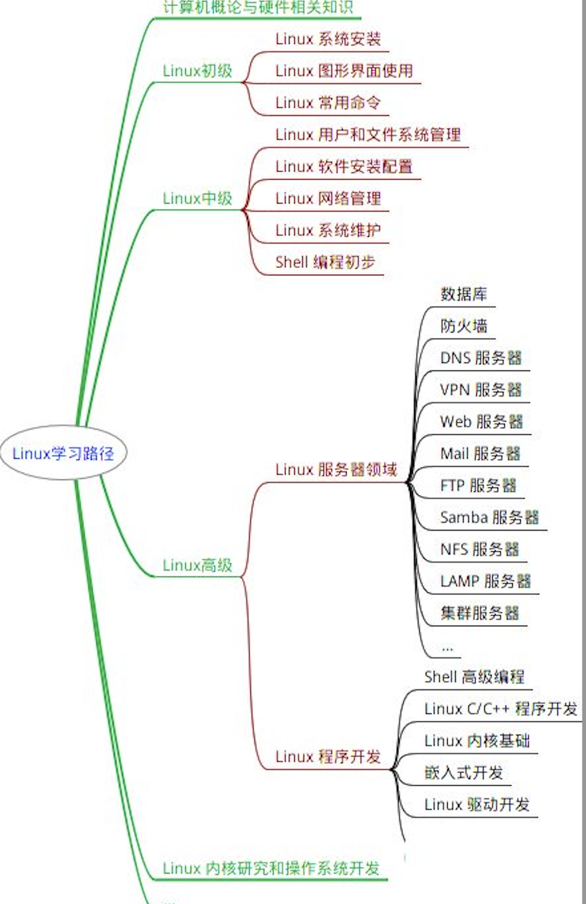
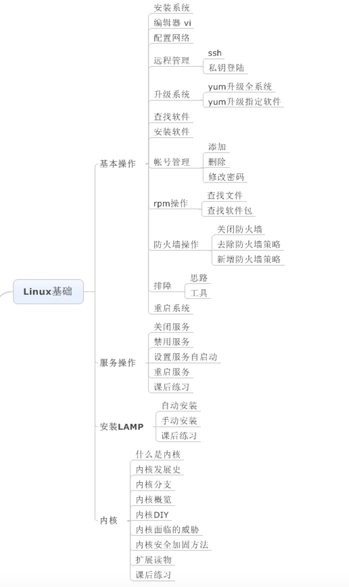
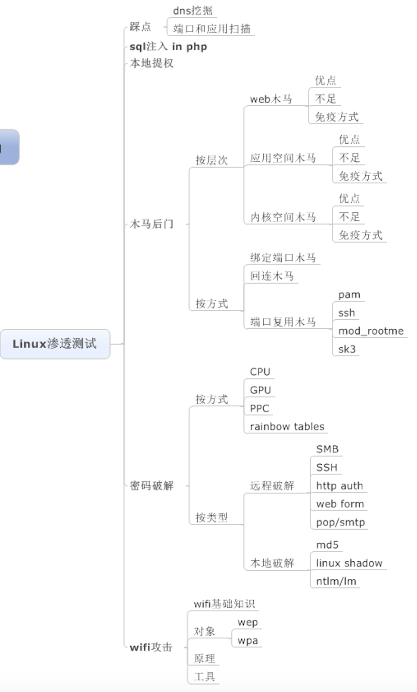
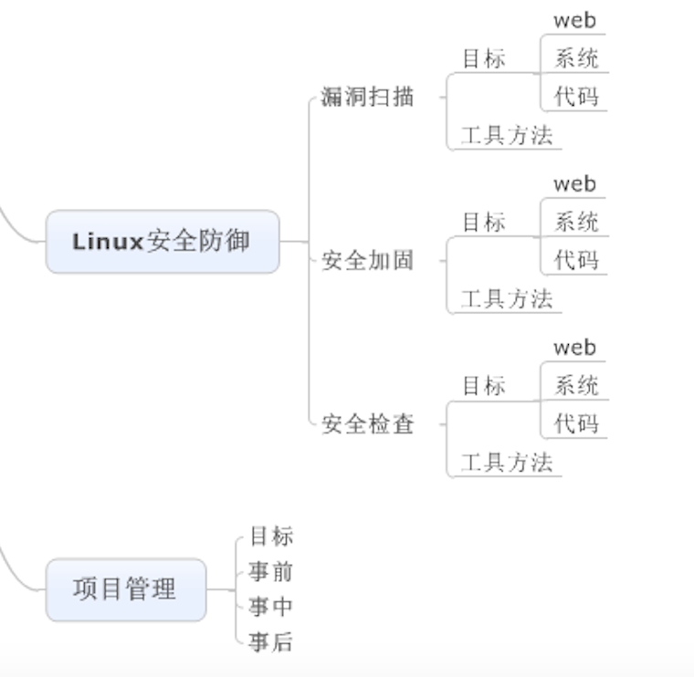
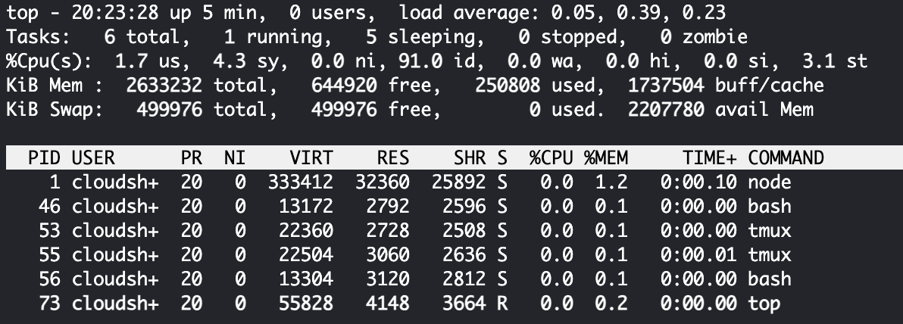

# Linux Security Coaching

# Linux 注意事项

- Linux 严格区分大小写
- Linux 中所有内容以文件形式保存，包括硬件：硬盘文件是/dev/sda-p
- Linux没有扩展名，d.ppt； 不靠扩展名区分文件类型。配置文件：d.conf，脚本文件：d.sh
- Linux所有的存储设备都必须挂载后，用户才可以使用。
- 

以下是常见的Linux目录及其作用的表格：

Here's a summarized table of common Linux directories and their functions:

| Name                          | Function                                                     |
| ----------------------------- | ------------------------------------------------------------ |
| **/boot**                     | Stores bootloader and kernel files for system startup 引导加载程序和内核文件 |
| **/bin (binary)**             | Contains essential **binary commands** for boot and recovery 系统启动和恢复时必需的基本命令 |
| **/sbin **(System Binary)     | Holds essential system administration commands系统管理员使用的基本系统命令如reboot、fdisk |
| **/dev (device)**             | Contains device files for hardware device access包含设备文件，用于访问计算机硬件设备 |
| **/etc**                      | Stores system-wide configuration files and directories配置文件和目录，如网络配置、用户配置 |
| **/home**                     | User home directories for personal files and configs 用户的主目录，每个用户在此目录下有一个子目录，用于存储其个人文件和配置。 |
| **/lib (Library)**            | Holds shared library files for system and applications包含共享库文件，这些文件由系统和应用程序使用。 |
| **/media**                    | Mount point for removable media devices 用于挂载可移动媒体设备，如光盘等。 |
| **/mnt (Mount)**              | Used for manually mounting temporary file systems 用于手动挂载临时文件系统, 如USB |
| **/opt (Optional)**           | Typically used for third-party software installation 用于安装和存储第三方软件。 /usr/local/ |
| **/proc (Process)**           | A virtual file system providing process and kernel info 包含有关正在运行的进程和内核状态的虚拟文件系统。/proc/cpuinfo: cpu information, /proc/net/: network protocol information. |
| **/root**                     | Home directory for the superuser (administrator) 超级用户（管理员）的主目录。 |
| **/srv (Service)**            | Contains data files related to provided services 包含服务数据 |
| /tmp                          | Stores temporary files, often cleared upon reboot 用于存储临时文件，重启后通常会清空。 |
| /usr (Unix Software Resource) | Contains system software, libraries, and documentation 包含系统软件资源目录。大多数系统软件、库文件和文档。 |
| /var (Variable)               | Stores frequently changing files like logs and caches包含经常变化的文件，如日志文件、缓存、邮件和打印队列等 |
| /sys                          | vitusal file system. 虚拟文件系统，保存内核相关信息。        |

These directories serve specific roles in organizing and managing files and configurations within a Linux system.

# Linux常用命令

1. <a href="#anchor"> 文件处理命令</a>
2. <a href="#anchor1"> 权限管理命令</a> 
3. <a href="#anchor2"> 文件搜索命令</a> 
4. <a href="#anchor3">用户管理命令</a> 
5.  <a href="#anchor4">网络命令</a> 
6. <a href="#anchor5">关机重启命令</a>
7. <a href="#anchor6">帮助命令及压缩解压命令</a>

1.<a id="anchor">文件处理命令</a>

- 命令格式
  - 命令 -选项 参数 e.g ls -la /etc
  - 简化选项：-a，完整选项：--all
  - r，w，x
  - -rw-r--r--: 
    - -: 文件类型 （-： 二进制文件；d:目录； l:软连接文件）
    - rw-:u user；r--:g group；r--:o other  （x:执行权限，运行时，是脚本或者命令）

- 目录处理命令

  | command name          | Path          | Access    | Func                    | Grammar                                                      |
  | --------------------- | ------------- | --------- | ----------------------- | ------------------------------------------------------------ |
  | ls (list)             | /bin/ls       | all users | list files in directory | ls -aldhi 文件或目录 （a: all，l:long, h:human, d:directory i:id)  -d:查看当前目录本身的信息；-i：查看id |
  | mkdir                 | /bin/mkdir    | -         | Create directory        | -p: 递归创建  mkdir -p /tmp/Japan/boduo                  |
  | cd (change directory) | Shell内置命令 |           | 切换目录                | cd /path/myfolder/                                           |
  | pwd                   | /bin/pwd      |           | Print working directory | pwd                                                          |
  | rmdir                 | /bin/rmdir    |           | remove empty directory  | Rmdir /path/folder                                           |
  | cp                    | /bin/cp       | -         | copy 文件，改名         | cp  -rp source destination   cp file1 file2 folder (copy 多个文件) |
  | mv                    | /bin/mv       | -         | Move, 改名              | mv /tmp/software /tmp/machine_learning mv file1 file2        |
  | rm                    | /bin/rm       | -         | Remove                  | rm -rf 文件或目录 f:force                                    |

- 文件处理命令

  | command name | Path          | Access    | Func               | Grammar                                                   |
  | ------------ | ------------- | --------- | ------------------ | --------------------------------------------------------- |
  | touch        | /bin/touch    | all users | 创建文件           | touch path/file：touch file.txt     touch "program files" |
  | cat          | /bin/cat      | -         | 显示文件           | cat -n files    -n: 显示行号                          |
  | tac          | /usr/bin/tac  | -         | 从最后一行开始显示 | tac 路径/文件                                             |
  | more         | /bin/more     | -         | 分页显示文件内容   | more 文件名 f或者空格:翻页，enter换行，q退出              |
  | less         | /usr/bin/less | -         | 分页显示，向上翻   | less 文件名，pageup，上箭头，/keyword：搜索，n            |
  | head         | /usr/bin/head | -         | 显示文件前面几行   | head -n 20 /etc/services                                  |
  | tail         | /usr/bin/tail | -         | 文件后面几行       | tail -nf /etc/services -f:动态显示文件末尾内容。监控日志  |

  

- 链接命令

  | command name | Path    | Access    | Func         | Grammar                                         |
  | ------------ | ------- | --------- | ------------ | ----------------------------------------------- |
  | ln           | /bin/ln | all users | 生成链接文件 | ln -s 源文件 目标文件   -s:create soft link |
  
  ln **-s** file files.soft：快捷方式，rwx权限。源文件删除，软连接也就不存在。可以跨分区，对目录可以。
  
  ln file files.hard：硬链接不能跨分区，不可以对目录进行硬链接；与源文件同时更新
  
  

2. <a id="anchor1">权限管理命令</a>

- Chmod: change the permissions mode of a file

  | command name | Path          | Access                  | Func                                                | Grammar                                                      |
  | ------------ | ------------- | ----------------------- | --------------------------------------------------- | ------------------------------------------------------------ |
  | chmod        | /bin/chmod    | all users               | change the permissions mode of a file               | chmod ugoa +-= rwx file/folder, -R  chmod o-w Python (other用户移除w权限) chmod 641 software/Python   chmod -R 666 Python |
  | chown        | /bin/chown    | Root 可以改文件的所有者 | change file ownership                               | chown 用户 文件或者目录 chown Sharon Heng                |
  | chgrp        | /bin/chgrp    | -                       | Change file group ownership                         | chgrp 用户组 文件或者目录 1.Add groud：groupadd Linux_P用户组  chgrp Linux_P Python (1.user name, 2.Group name)  当chmod改变文件的权限，文件的所属组的权限也被改变。 |
  | umask        | Shell内置命令 | -                       | the user file-creation mask显示和设置文件的缺省权限 | umask -S, -S:以rwx形式显示新建文件缺省权限   umask: 0022: ----w--w-  **umask -S**：777-022=755  If umask-->023: **umask 023** 就可以了 |

  

- test
- test

3. <a id="anchor2">文件搜索命令</a>

- 

4. <a id="anchor3">用户管理命令</a> 

5. <a id="anchor4">网络命令</a>

   | command name | Path           | Access    | Func                           | Grammar                                        |
   | ------------ | -------------- | --------- | ------------------------------ | ---------------------------------------------- |
   | write        | /usr/bin/write | all users | 给用户发信息，以Ctrl+D保存结束 | write UserName （在线用户）w：查看哪些用户在线 |

   

6. <a id="anchor5">关机重启命令</a>

7. <a id="anchor6">帮助命令及压缩解压命令</a>

- 

  | command name | Path | Access | Func | Grammar |
  | ------------ | ---- | ------ | ---- | ------- |
  |              |      |        |      |         |

  

| Command    | Func                                           | Return                                                       |
| ---------- | ---------------------------------------------- | ------------------------------------------------------------ |
| **uptime** | 查看系统负载和运行时间                         | ╰─○ uptime 15:21  up 23:24, 4 users, load averages: 2.29 2.14 2.30    当前时间：显示了当前系统时间。  运行时间：表示自上次启动系统以来的时间。它通常以天、小时、分钟的形式显示。  用户登录数量：显示当前登录到系统的用户数量。 平均负载：系统的平均负载是过去1分钟、5分钟和15分钟内的平均负载。这些数字告诉您系统在这些时间段内的工作负荷。 |
| **Top**    | 实时查看系统运行状态(Monitor system Resources) | $ top -b -n 1 \| tee output (save and check the result of output)  $ top -b -n 1 > output (See all output) |
|            |                                                |                                                              |
|            |                                                |                                                              |
|            |                                                |                                                              |
|            |                                                |                                                              |
|            |                                                |                                                              |
|            |                                                |                                                              |

The following items represent: the percentage of CPU use

us: user CPU time：running users' processes that are not niced

sy: system CPU time: running the kernel and kernel processes.

ni: nice CPU time: user's processes that have been niced

id: CPU idle time: idle

wa: I/O wait: waiting for I/O

hi: hardware interrupts: time spent servicing hardware interrupts.

si: software interrupts: 

st: steal time: CPU time was stolen from you for other tasks.
